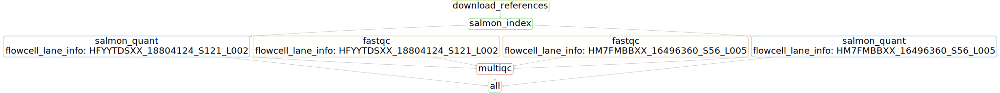

# OGVFB_RNAseq
Generic RNA-seq quant for OGVFB group

# Usage
1. Copy config.yaml to your directory and create a sample <-> fastq file table (tab separated, no columns)
2. Run: `sbatch --time=8:00:00 ~/git/OGVFB_RNAseq/Snakemake.wrapper.sh config.yaml`

# Workflow

